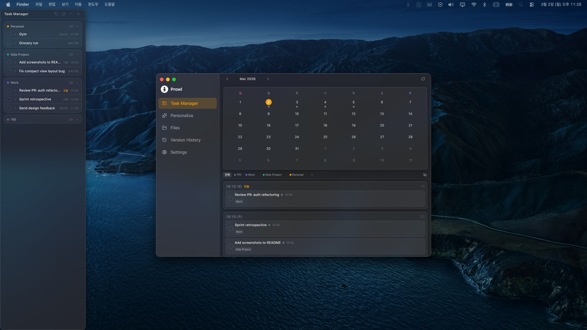
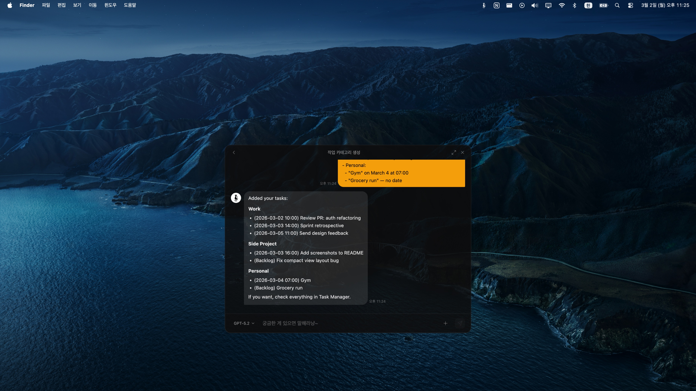

<p align="center">
  
</p>

<h1 align="center">Prowl</h1>

<p align="center">
  <strong>A cat that lives in your background, assisting your tasks from the macOS menubar</strong>
</p>

<p align="center">
  
  
  
</p>

---

## What is Prowl?

**Prowl**은 macOS 메뉴바에 상주하는 생산성 앱입니다.

태스크 관리, AI 채팅, 파일 브라우저, AI 메모리를 메뉴바 하나에서 처리합니다.

---

## ✨ Features

### Task Manager

파일 기반 태스크를 날짜·카테고리로 관리합니다.

- **Full View** — 월별 캘린더 그리드에서 태스크를 확인하고 추가·수정·완료 처리합니다. 날짜를 클릭하면 해당 날의 태스크 목록이 펼쳐집니다.
- **Compact View** — 메뉴바에서 바로 꺼내는 스티키 윈도우. 카테고리별·날짜별로 오늘 할 일을 빠르게 훑고 완료 처리할 수 있습니다.



### Personalize

AI 동작 방식을 내 취향으로 조정합니다.

- **Memory** — AI에게 기억시킬 선호·규칙을 영구 저장
- **System Prompt** — 기본 시스템 프롬프트를 직접 편집
- **톤 & 매너** — AI 응답 스타일 설정

### Prowl Chat

ChatGPT OAuth 또는 API Key로 AI 채팅을 사용합니다. 인증 설정은 Settings 탭에서 할 수 있으며, 채팅창 드롭다운에서 모델을 즉시 전환할 수 있습니다.



---

## 🚀 Installation

```bash
brew install BangDori/prowl/prowl
```

Homebrew로 설치하면 앱 내에서 자동 업데이트가 지원됩니다.

