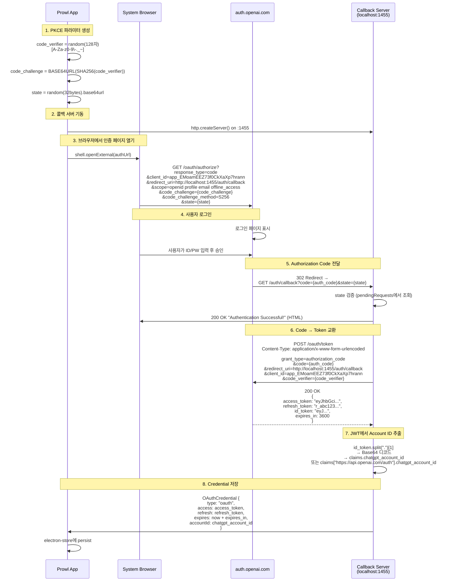
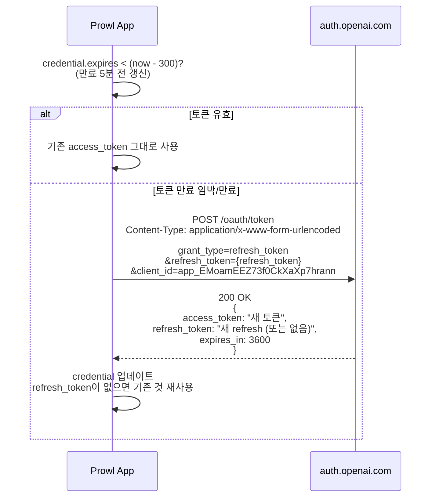
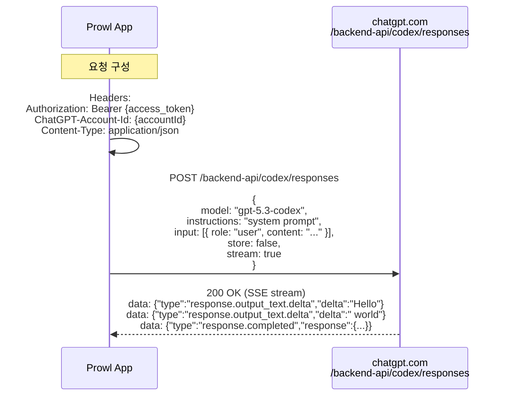
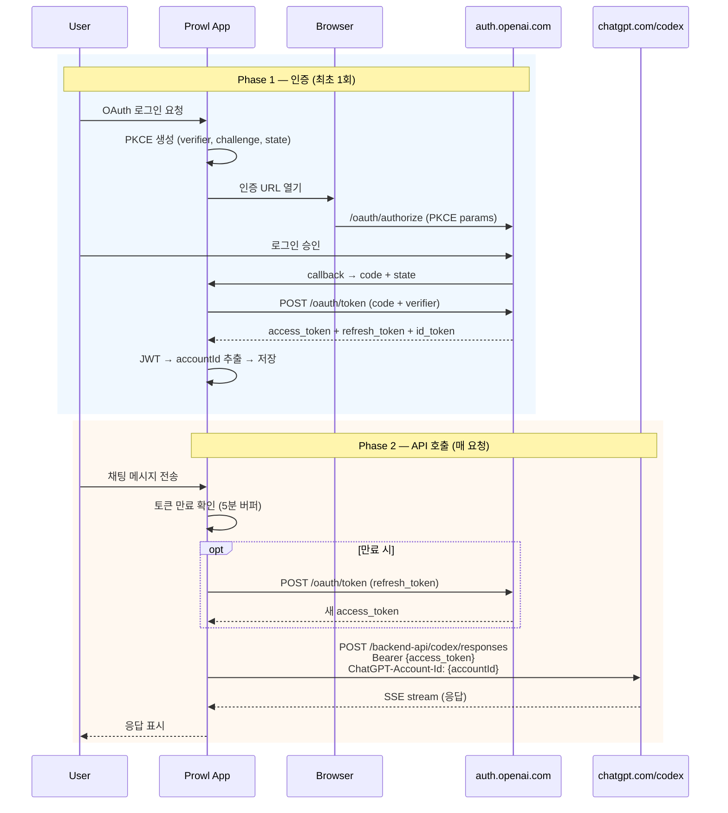

# OpenAI OAuth 시퀀스 다이어그램 (Pure OAuth Flow)

Electron IPC 레이어를 제외한 순수 OAuth 2.0 PKCE 프로토콜 흐름.

---

## 1. 인증 (Authorization Code + PKCE)

---

## 2. 토큰 갱신 (Refresh Token Grant)

---

## 3. Codex API 호출 (OAuth 토큰 사용)

---

## 4. 전체 흐름 요약 (End-to-End)

---

## OAuth 파라미터 요약

| 파라미터 | 값 |
|---------|-----|
| Grant Type | Authorization Code + PKCE |
| Client ID | `app_EMoamEEZ73f0CkXaXp7hrann` |
| Auth Endpoint | `https://auth.openai.com/oauth/authorize` |
| Token Endpoint | `https://auth.openai.com/oauth/token` |
| Redirect URI | `http://localhost:1455/auth/callback` |
| Scope | `openid profile email offline_access` |
| PKCE Method | S256 (SHA-256) |
| Code Verifier | 128자 랜덤 (`[A-Za-z0-9\-._~]`) |
| State | 32바이트 랜덤 (base64url) |
| Token Refresh | 만료 5분 전 자동 갱신 |
