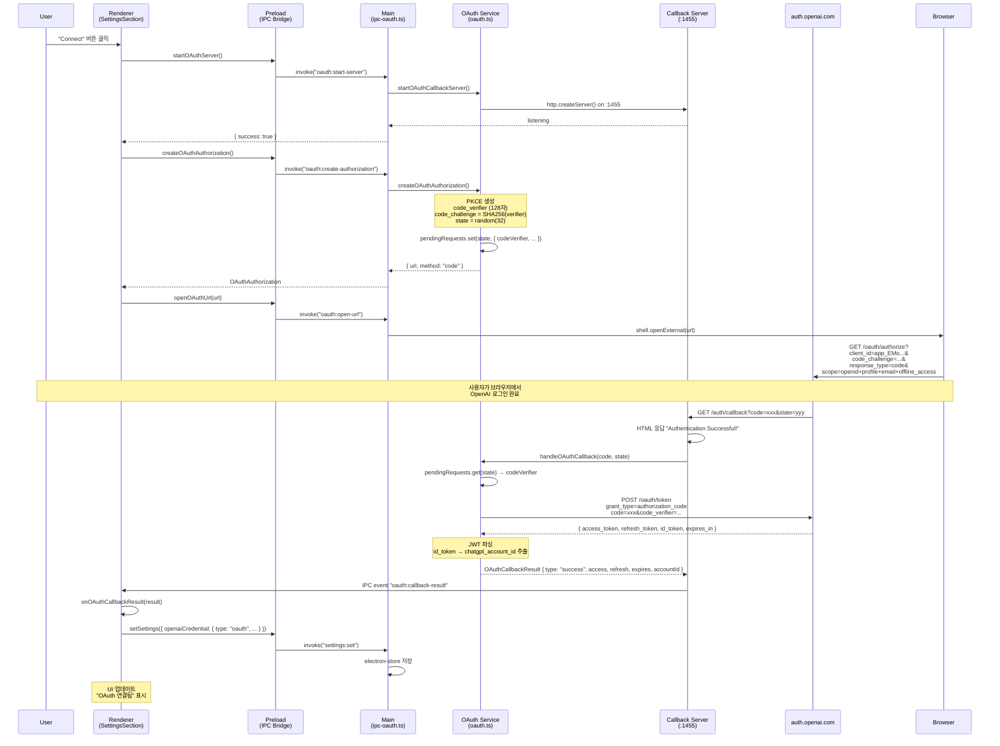
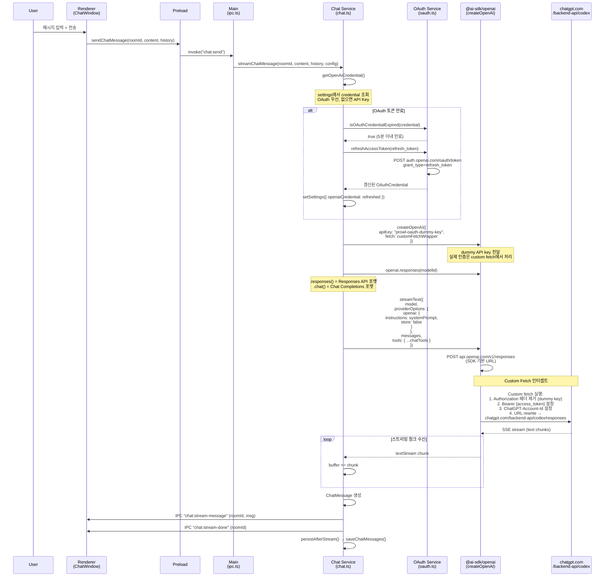
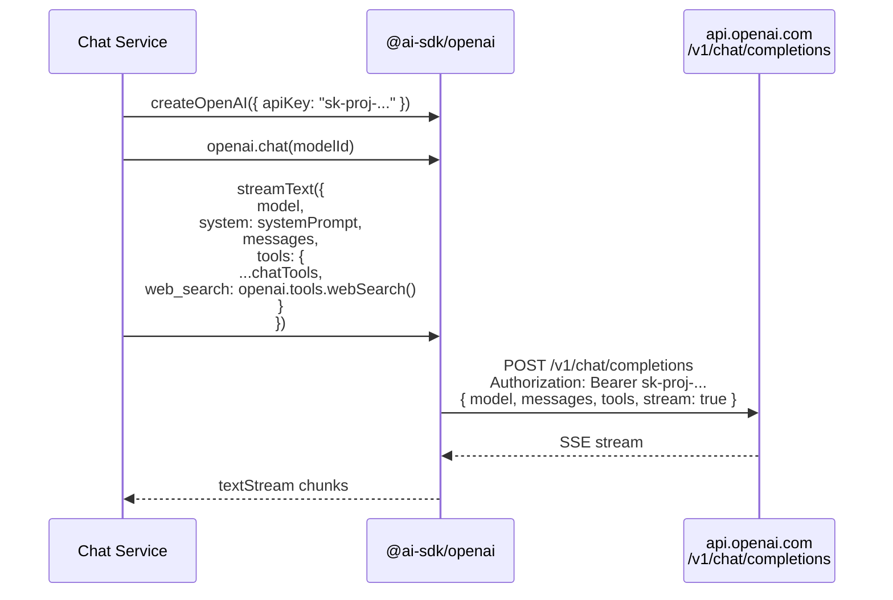
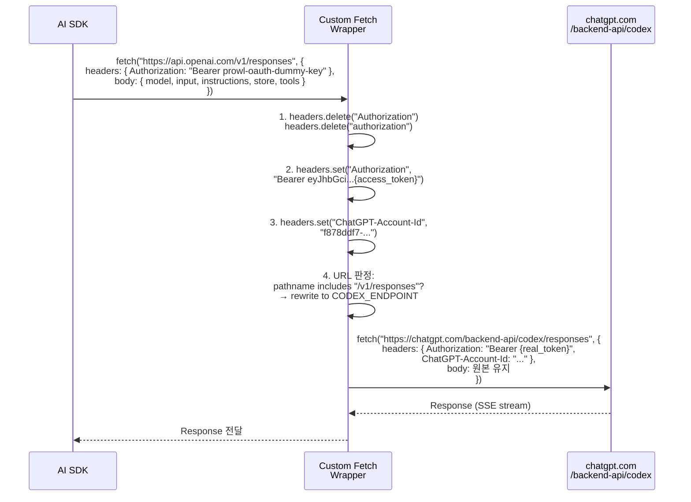
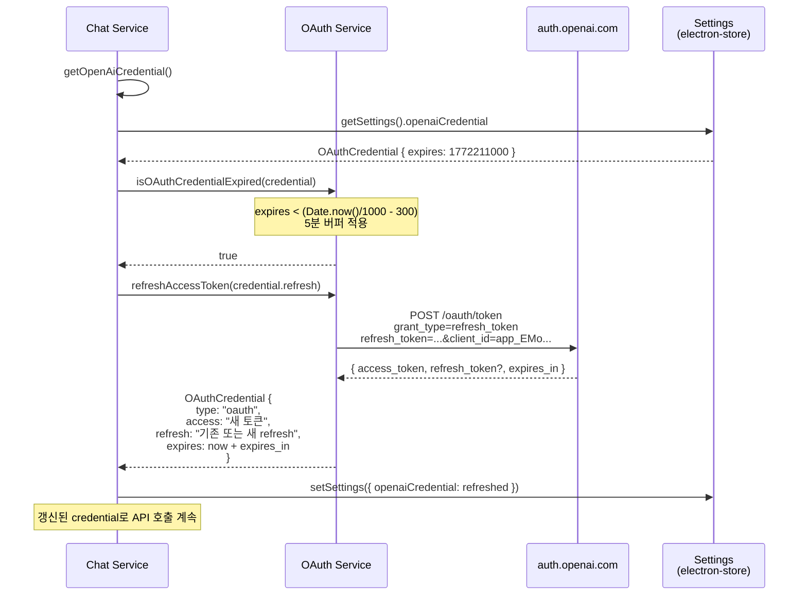

# Prowl OpenAI OAuth 아키텍처

## 개요

Prowl은 OpenAI의 ChatGPT OAuth를 통해 사용자 인증 후, Codex 엔드포인트로 AI 채팅을 제공한다.
API Key 방식도 병행 지원하며, 인증 타입에 따라 엔드포인트/모델/요청 포맷이 분기된다.

## 인증 방식 비교

| 항목 | OAuth (Codex) | API Key |
|------|--------------|---------|
| 엔드포인트 | `chatgpt.com/backend-api/codex/responses` | `api.openai.com/v1/chat/completions` |
| API 포맷 | Responses API (`instructions` + `input`) | Chat Completions (`system` + `messages`) |
| SDK 메서드 | `openai.responses(modelId)` | `openai.chat(modelId)` |
| 인증 헤더 | `Bearer {access_token}` + `ChatGPT-Account-Id` | `Bearer {api_key}` |
| 토큰 갱신 | 자동 (5분 전 refresh) | 불필요 |
| 모델 | Codex 전용 (gpt-5.3-codex 등) | 범용 (gpt-5.2, gpt-5-mini 등) |
| store | `false` (필수) | 기본값 사용 |
| web_search | 미지원 (제외) | 지원 |

## 파일 구조

```
src/
├── shared/
│   ├── types/common.ts          # OAuthCredential, ApiKeyCredential, OpenAICredential 타입
│   └── ipc-schema.ts            # oauth:* IPC 채널 스키마 (7 invoke + 1 event)
├── main/
│   ├── services/
│   │   ├── oauth.ts             # PKCE OAuth flow, 콜백 서버, 토큰 교환/갱신
│   │   ├── chat.ts              # 채팅 스트리밍 (OAuth/API Key 분기)
│   │   └── settings.ts          # electron-store 기반 credential 저장
│   ├── ipc-oauth.ts             # OAuth IPC 핸들러 등록
│   └── ipc.ts                   # registerOAuthHandlers() 호출
├── preload/
│   └── index.ts                 # OAuth API 노출 (invokeIpc + onOAuthCallbackResult)
└── renderer/
    └── components/sections/
        └── SettingsSection.tsx   # OAuth Connect/Disconnect UI
```

## 핵심 데이터 타입

```typescript
// OAuth 자격 증명 (ChatGPT 계정 로그인)
interface OAuthCredential {
  type: "oauth";
  access: string;       // access_token (Bearer 토큰)
  refresh: string;      // refresh_token (갱신용)
  expires: number;      // 만료 시각 (Unix timestamp, seconds)
  accountId?: string;   // ChatGPT-Account-Id (JWT에서 추출)
}

// API Key 자격 증명
interface ApiKeyCredential {
  type: "api";
  key: string;          // sk-proj-... API 키
}

// 통합 타입 (chat.ts에서 사용)
type OpenAICredential = OAuthCredential | ApiKeyCredential;
```

## 시퀀스 다이어그램

### 1. OAuth 로그인 Flow



### 2. 채팅 메시지 전송 Flow (OAuth)



### 3. 채팅 메시지 전송 Flow (API Key)



### 4. Custom Fetch Wrapper 상세



### 5. 토큰 갱신 Flow



## OAuth 설정값

| 항목 | 값 |
|------|-----|
| Client ID | `app_EMoamEEZ73f0CkXaXp7hrann` |
| Authorization Endpoint | `https://auth.openai.com/oauth/authorize` |
| Token Endpoint | `https://auth.openai.com/oauth/token` |
| Redirect URI | `http://localhost:1455/auth/callback` |
| Scope | `openid profile email offline_access` |
| PKCE Method | S256 |
| Callback Port | 1455 |
| Codex API Endpoint | `https://chatgpt.com/backend-api/codex/responses` |

## IPC 채널

### Invoke (renderer → main, 응답 있음)

| 채널 | params | return |
|------|--------|--------|
| `oauth:start-server` | `[]` | `IpcResult` |
| `oauth:create-authorization` | `[]` | `OAuthAuthorization` |
| `oauth:open-url` | `[url: string]` | `IpcResult` |
| `oauth:callback` | `[{ code, state }]` | `OAuthCallbackResult` |
| `oauth:refresh-token` | `[refreshToken]` | `{ success, credential?, error? }` |
| `oauth:is-expired` | `[credential]` | `{ valid, expired }` |
| `oauth:validate-credential` | `[credential]` | `{ isValid, type }` |

### Event (main → renderer, 단방향)

| 채널 | params |
|------|--------|
| `oauth:callback-result` | `[OAuthCallbackResult]` |

## Codex 허용 모델 (visibility=list + api=true)

| 모델 | context_window | 비고 |
|------|---------------|------|
| gpt-5.3-codex | 272,000 | 기본 모델 |
| gpt-5.2-codex | 272,000 | |
| gpt-5.2 | 272,000 | |
| gpt-5.1-codex-max | 272,000 | |
| gpt-5.1-codex-mini | 272,000 | |

## 해결한 에러 이력

| # | 에러 | 원인 | 수정 |
|---|------|------|------|
| 1 | 401 Missing scopes: model.request | OAuth 토큰을 api.openai.com에 직접 전송 | dummy key + custom fetch + URL rewrite |
| 2 | 400 Instructions are required (1차) | `.chat()` → Chat Completions 포맷 | `.responses()` 메서드 사용 |
| 3 | 400 gpt-5-mini not supported | Codex 미지원 모델 | 모델 목록 분리 |
| 4 | 400 Instructions are required (2차) | `system` 파라미터가 `instructions`로 매핑 안 됨 | `providerOptions.openai.instructions` 사용 |
| 5 | 400 Store must be set to false | Codex는 store=false 필수 | `providerOptions.openai.store: false` |
